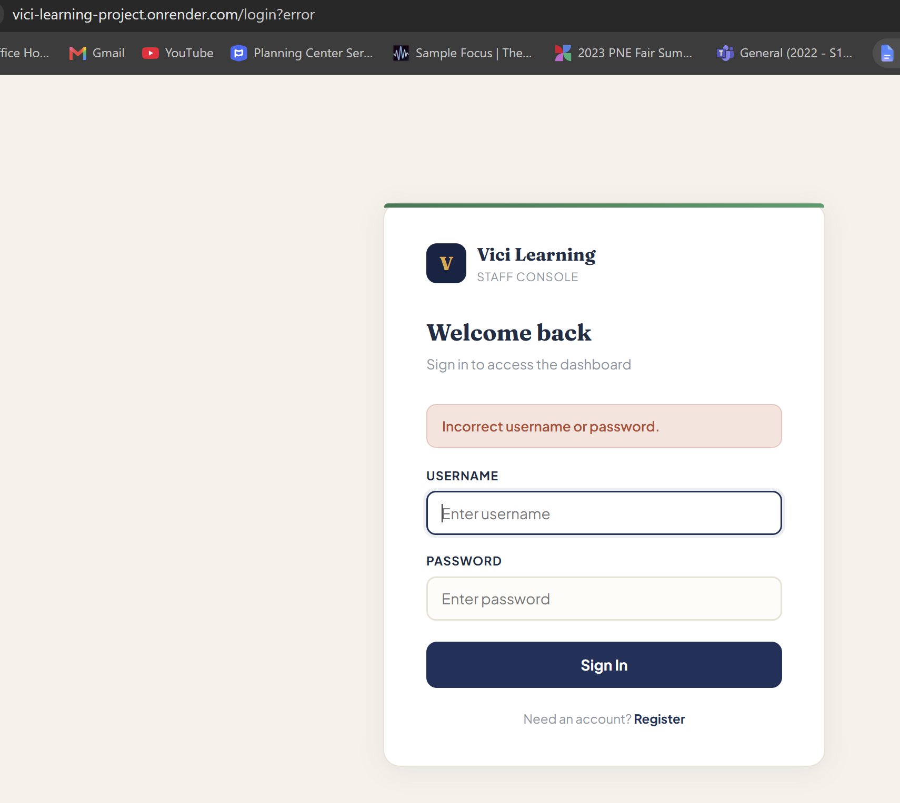
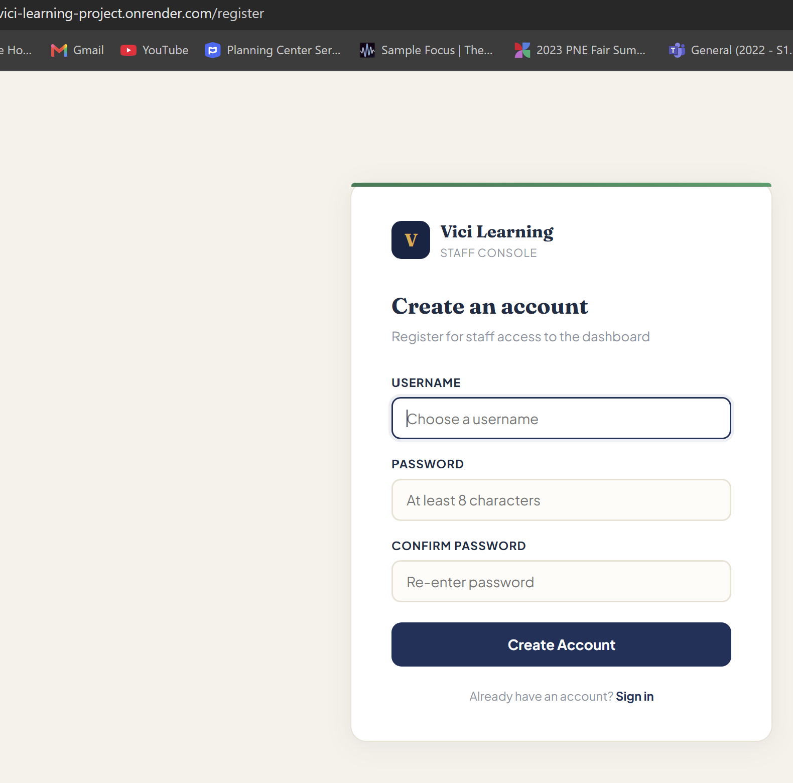
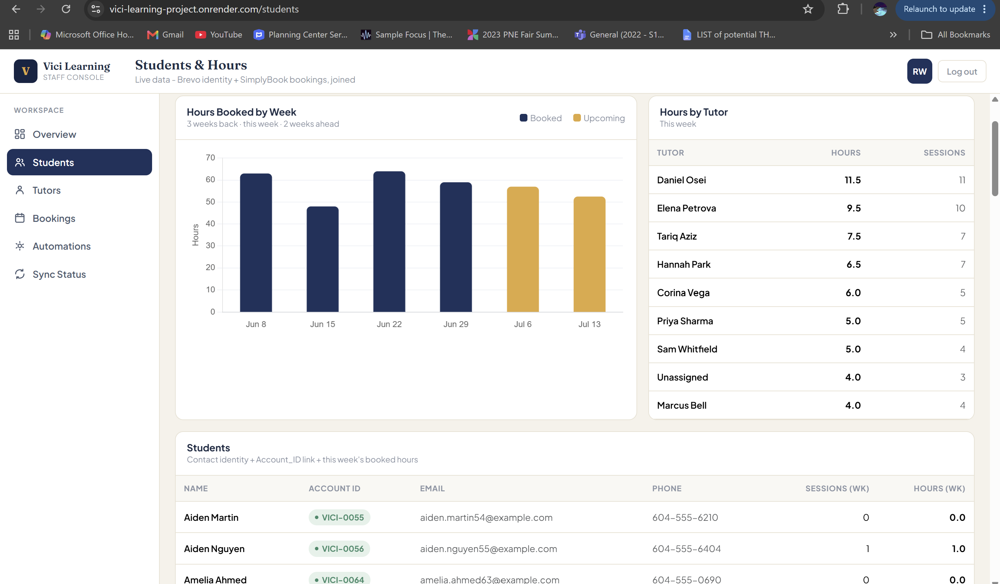
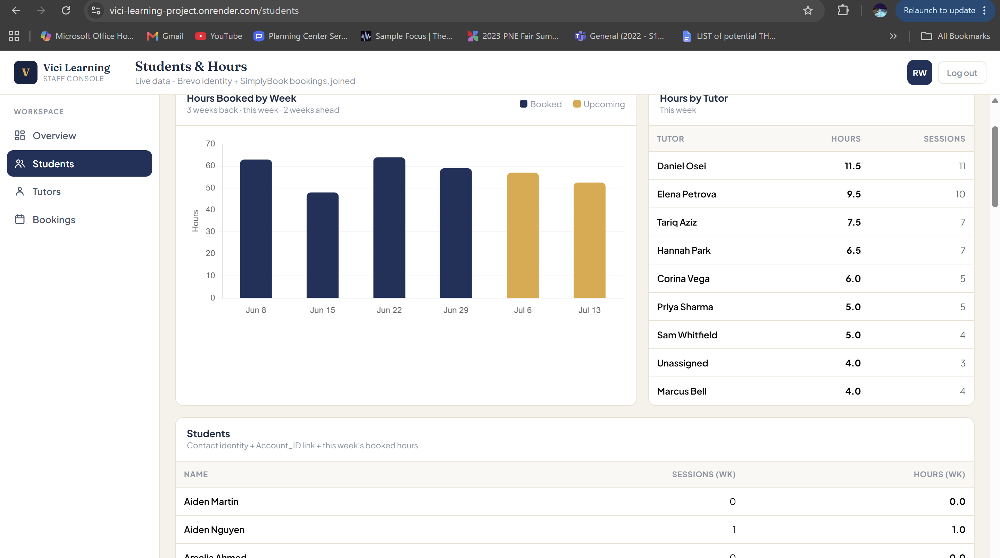
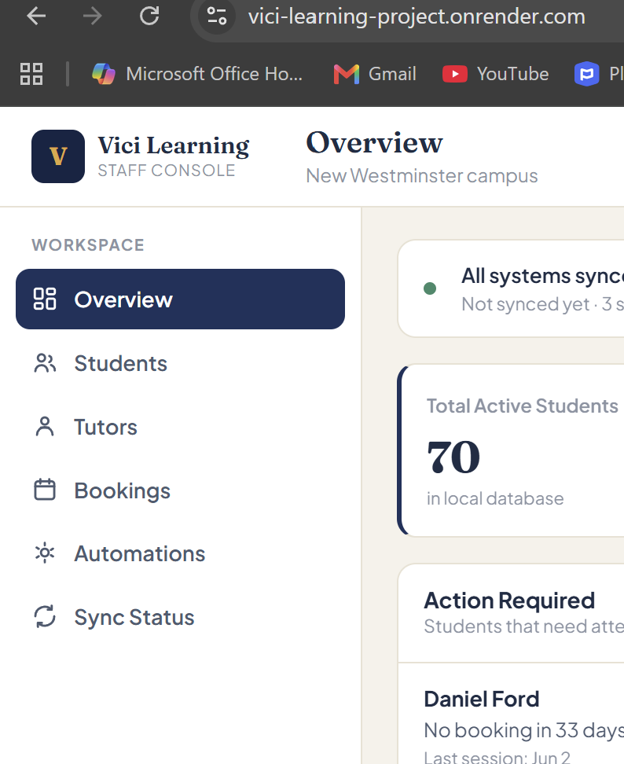
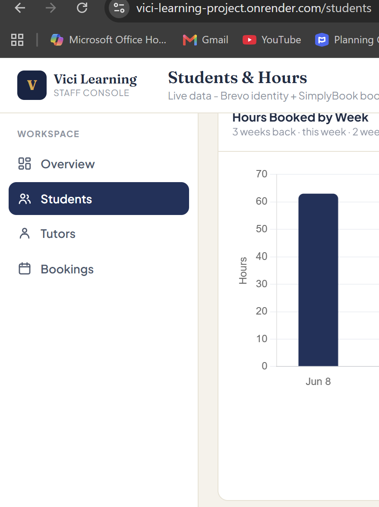
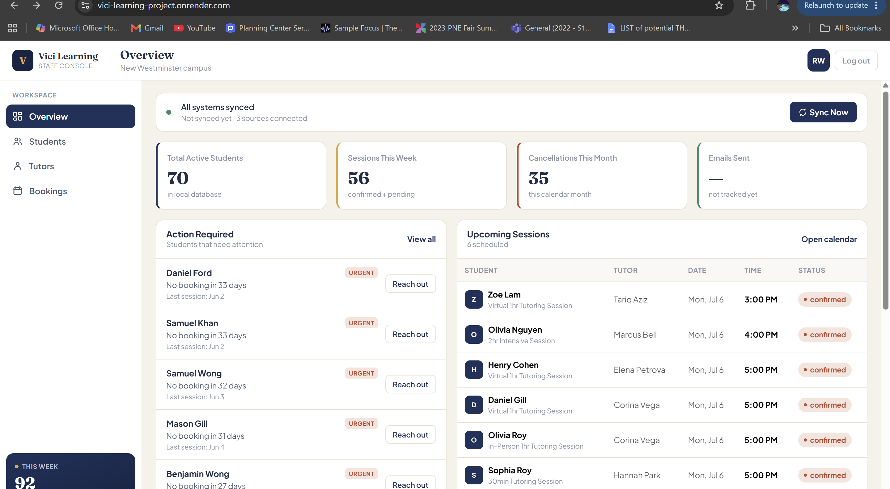
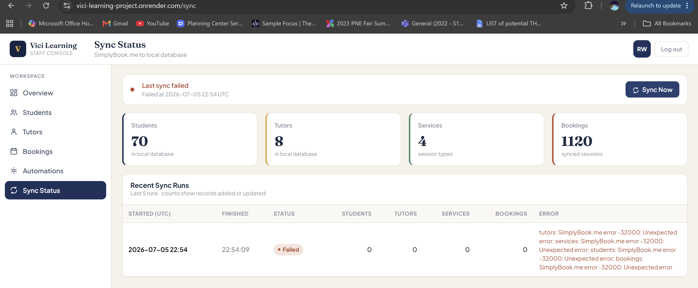
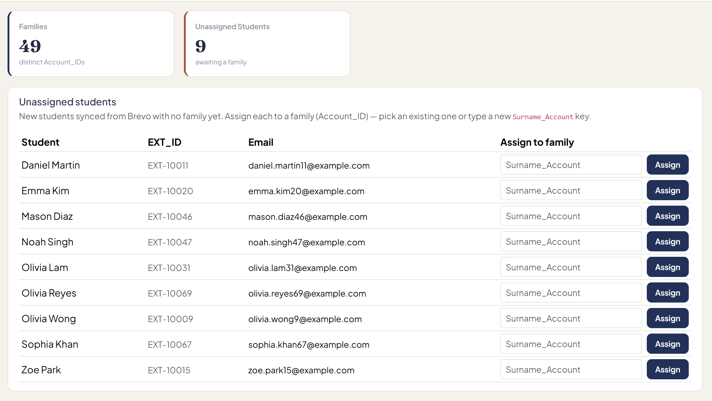
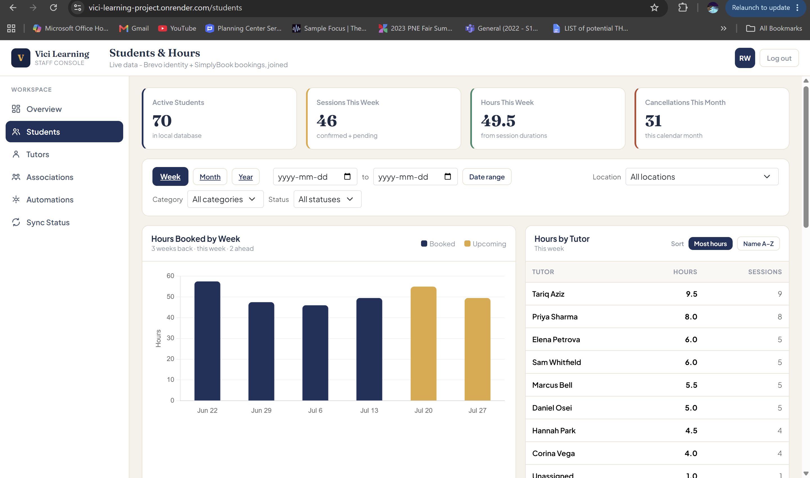

# Vici Learning Integration Dashboard
## Requirements and Specification Document

**Course:** CMPT 276, Group 15
**Client:** Sarah Alhower, Vici Learning
**Date:** 07/20/2026
**Version:** 2.0 (Iteration 2)

### Change marking key

Everything added or changed for Iteration 2 is marked so you can see how the system grew since Iteration 1:

- **[NEW · Iteration 2]** marks a story or section that did not exist in Iteration 1 (shown in green).
- **[UPDATED · Iteration 2]** marks content that existed in Iteration 1 and changed this iteration (shown in blue).

Content with no marker is carried over from Iteration 1 unchanged.

---

## Submission Info

| Item | Link / Value |
|------|--------------|
| Git repository | https://github.com/WL0000000/Vici-Learning-Project |
| Live web app (Render) | https://vici-learning-project.onrender.com |
| Admin login | username `Admin`, password `ViciLearning2026` |
| Screencast | see the link submitted alongside this document |

Tutor accounts are created through the registration page, so a marker can sign up as a new user and see the restricted view without us handing out a second password.

> Note on the Render link: the free tier puts the service to sleep after a period of no traffic, so the first request after a quiet spell takes about a minute to wake. Open the link once and give it a moment before testing.

---

## Project Abstract

Vici Learning is a tutoring company that runs its day to day work across several tools that do not talk to each other: SimplyBook.me for bookings, Brevo for email and client records, and Notion for the tutor list. Because the systems are separate, staff spend a few hours each week exporting reports and lining them up by hand in a spreadsheet to answer basic questions, such as which students have stopped booking or which families still owe for sessions. Our web application sits on top of those tools, pulls their data into one PostgreSQL database on a schedule, and gives staff a single place to check bookings, group students into families, watch prepaid session balances, and act on the follow up work that used to live in the spreadsheet. The dashboard reads only from the local database, so pages stay fast and keep working even when an outside service is briefly down.

## Customer

The customer is the administrative and operations staff of Vici Learning, led by the owner, Sarah Alhower. These are the people who currently keep the business running by reconciling exports from four separate systems every week. There is a second, future customer type as well: tutors, who will get a view limited to their own students. Parents and students are never users of this application; it is an internal staff tool, and the client has been firm that client data must stay inside the staff-only side.

## Competitive Analysis

There are established tutoring management products in this market, including TutorCruncher, Teachworks, and Oases. They are capable, but they solve Vici's problem by replacing the tools Vici already pays for and knows how to use. Moving to one of them would mean dropping the SimplyBook.me and Brevo subscriptions, migrating years of data, retraining staff, and taking on per-seat or per-student fees. The client set a hard rule that the project runs on free tiers and existing subscriptions only.

Our approach is different in that we do not replace anything. The dashboard reads from Vici's current tools and joins their data in one view, so staff keep booking in SimplyBook.me and emailing in Brevo exactly as they do now. The piece we own that no off-the-shelf product gives Vici is the family-to-student mapping (the "association account"), which is the manual join the staff maintain by hand today and which does not export cleanly from Brevo. That mapping is the core of what makes our tool fit Vici rather than a generic tutoring suite.

---

## User Stories

### Actors

- **Administrator (persona: Jane).** Jane runs the front office at Vici. She books sessions, chases families who have not paid, assigns new students to their family accounts, and needs the full picture across every student. She maps to the `ADMIN` role.
- **Tutor (persona: Joe).** Joe teaches a handful of students each week. He wants to see who he is working with and how many hours are on the books. He has no reason to see a family's billing account, contact details, or the sync and email tools. He maps to the `TUTOR` role.
- **The system (scheduled sync).** Some stories are carried out by a background job rather than a person. The hourly sync and the reconciliation with Brevo run on their own and record what they did in a log an administrator can read.

Each story lists its actors, the trigger and preconditions, the actions and the resulting state, and acceptance tests with concrete values for both a success case and a failure case. Every story also carries an `Iteration` field and a story-point estimate. Story points use a Fibonacci scale (1, 2, 3, 5, 8, 13), where higher numbers mean more effort and more uncertainty.

---

### Iteration 1 stories

These stories were delivered in Iteration 1 and still hold. They are kept here so the specification stays complete. **[UPDATED · Iteration 2]** Story 5 changed slightly this iteration, noted inline.

#### Story 1: Register an account
As a new staff member, I want to create an account with a username and password so that I can get into the dashboard without an admin setting it up for me.

- **Actors:** unauthenticated visitor.
- **Preconditions / trigger:** the visitor opens the registration page while signed out.
- **Actions / postconditions:** the visitor submits a username, a password, and a password confirmation. On success the account is saved with the `TUTOR` role and the visitor is sent to the login page with a confirmation banner.
- **Acceptance tests:**
  - Success: submitting username `joe.tutor` with password `teachwell9` in both fields creates the account and redirects to the login page with the banner "Account created". A later query of the users table shows one row for `joe.tutor` with a hashed password.
  - Failure: submitting username `Admin` (already taken) reloads the page with "Username already taken", keeps `Admin` in the username box, and clears both password fields. No new row is written.
- **Iteration:** 1
- **Story points:** 5

#### Story 2: Log in
As a registered user, I want to sign in with my username and password so that I can reach the pages my role allows.

- **Actors:** registered user (admin or tutor).
- **Preconditions / trigger:** the user opens the login page while signed out and has a valid account.
- **Actions / postconditions:** the user submits credentials. On success a session starts and the user lands on the overview page.
- **Acceptance tests:**
  - Success: `Admin` with `ViciLearning2026` reaches the overview page and the sidebar renders.
  - Failure: `Admin` with `wrongpass` reloads the login page with "Incorrect username or password". The message does not reveal which field was wrong.
- **Iteration:** 1
- **Story points:** 3

#### Story 3: Log out
As a signed-in user, I want to log out so that the next person on the same computer cannot use my session.

- **Actors:** signed-in user.
- **Preconditions / trigger:** the user is signed in and clicks Log out.
- **Actions / postconditions:** the session ends and the user is returned to the login page with a confirmation.
- **Acceptance tests:**
  - Success: after clicking Log out the user sees the login page with "You have been logged out".
  - Failure: after logging out, requesting `/students` directly redirects to the login page instead of showing the content.
- **Iteration:** 1
- **Story points:** 2

#### Story 4: Full admin access
As an office administrator (Jane), I want access to every page so that I can run syncs, review the email queue, and see complete student records.

- **Actors:** administrator.
- **Preconditions / trigger:** an `ADMIN` user is signed in.
- **Actions / postconditions:** the admin sees every section in the sidebar and every column in the students table.
- **Acceptance tests:**
  - Success: signed in as `Admin`, the sidebar shows Sync Status and Automations, and the students table includes the Account ID, Email, and Phone columns.
  - Failure: with an expired or absent session, requesting an admin page redirects to the login page before the page loads.
- **Iteration:** 1
- **Story points:** 3

#### Story 5: Restricted tutor view
As a tutor (Joe), I want to see the students and dashboard but be kept out of the admin tools so that I only deal with what my role needs.

- **Actors:** tutor.
- **Preconditions / trigger:** a `TUTOR` user is signed in.
- **Actions / postconditions:** the tutor can open the overview and students pages. Admin-only links are absent from the sidebar, and admin routes are blocked on the server. **[UPDATED · Iteration 2]** The students page gained several new columns and filters this iteration (see Stories 12 and 13); the role rules still apply to the new columns, so the sensitive ones stay admin-only.
- **Acceptance tests:**
  - Success: signed in as a tutor, the overview and students pages load, and the sidebar has no Sync Status or Automations link.
  - Failure: a tutor requesting `/sync` or `/comms/review` directly receives a 403 response rather than the page.
- **Iteration:** 1
- **Story points:** 5

#### Story 6: Keep sensitive student info admin only
As the client, I want tutors to see student names and hours but not family contact or billing details so that private information stays with admins.

- **Actors:** administrator, tutor.
- **Preconditions / trigger:** any signed-in user opens the students page.
- **Actions / postconditions:** the page renders the sensitive columns only for an admin.
- **Acceptance tests:**
  - Success: a tutor viewing the students page sees Name, weekly Sessions, and Hours, and does not see Account ID, Email, or Phone.
  - Failure (as a guard the other way): an admin viewing the same page does see those three columns, which confirms the hiding is tied to the role.
- **Iteration:** 1
- **Story points:** 3

#### Story 7: View dashboard metrics
As an administrator, I want the dashboard to show weekly hours, active student counts, and upcoming sessions worked out from our own database so that I can answer questions without exporting spreadsheets.

- **Actors:** administrator.
- **Preconditions / trigger:** the admin opens the overview or students page.
- **Actions / postconditions:** the page renders charts and tables built from local data, with hours taken from each booking's real duration.
- **Acceptance tests:**
  - Success: a two-hour booking counts as 2.0 hours in the weekly total, not 1.0.
  - Failure: with an empty database the page still loads and shows zeros or a "no data" note rather than an error.
- **Iteration:** 1
- **Story points:** 8

#### Story 8: Sync data from SimplyBook
As an administrator, I want to pull bookings, clients, services, tutors, invoices, and memberships from SimplyBook into our database so that every page reads fast local data.

- **Actors:** administrator, the system.
- **Preconditions / trigger:** the admin clicks Sync Now, or the hourly job fires.
- **Actions / postconditions:** each part of the sync runs in its own transaction and the status page shows updated counts and a success flag.
- **Acceptance tests:**
  - Success: clicking Sync Now updates the counts on the status page and records a successful run.
  - Failure: if one upstream call fails, that step is marked failed in the log, the other steps still finish, and the run is recorded as not fully successful.
- **Iteration:** 1
- **Story points:** 13

---

### Iteration 2 stories [NEW]

Iteration 2 delivered two large features the client asked for at the kickoff and refined in the meetings since: the **association account database**, which is the family-to-student mapping Sara called her single most valuable ask, and the **student and family dashboard with actionable tasks**, which turns the synced data into the follow-up work staff used to track by hand. The stories below make up those two features. All of them are new this iteration.

#### Story 9: See students that have no family yet [NEW · Iteration 2]
As an administrator, I want new students to show up in an "unassigned" list so that I know which ones still need to be placed into a family.

- **Actors:** administrator, the system.
- **Preconditions / trigger:** the sync has pulled students from Brevo, and at least one of them has no family (`Account_ID`) set. The admin opens the associations page.
- **Actions / postconditions:** the page shows an Unassigned Students panel listing each such student with their name, `EXT_ID`, and email, plus a count card at the top. Assigning a student (Story 10) removes them from this list.
- **Acceptance tests:**
  - Success: after a sync that adds a student named "Ravi Gill" with no family, the Unassigned Students panel lists "Ravi Gill" and the Unassigned count card reads one higher than before.
  - Failure: when every student already has a family, the panel shows "Nothing to assign, every student belongs to a family" and no student rows.
- **Iteration:** 2
- **Story points:** 5

#### Story 10: Assign a student to a family [NEW · Iteration 2]
As an administrator, I want to place an unassigned student into a family account so that siblings are grouped under one family and the billing link is set.

- **Actors:** administrator.
- **Preconditions / trigger:** an unassigned student is shown on the associations page. The admin picks or types a family key for that student and clicks Assign.
- **Actions / postconditions:** the student's `Account_ID` is set to that family key, the student moves out of the Unassigned panel, and they appear under the matching family in the Families rollup. A dropdown of existing family keys is offered so staff do not have to type or scroll.
- **Acceptance tests:**
  - Success: for unassigned student "Ishaan Sharma", typing `Sharma_Account` and clicking Assign removes Ishaan from the Unassigned panel and lists him under the `Sharma_Account` family, and his Account ID column on the students page reads `Sharma_Account`.
  - Failure: clicking Assign with the family field left empty is rejected because the field is required, and Ishaan stays in the Unassigned panel.
- **Iteration:** 2
- **Story points:** 5

#### Story 11: Name a family and add notes [NEW · Iteration 2]
As an administrator, I want to give a family a friendly name and keep a short note so that the association is readable and staff can record context.

- **Actors:** administrator.
- **Preconditions / trigger:** a family exists in the Families rollup. The admin edits its name or notes field and clicks Save.
- **Actions / postconditions:** the family record stores the name and note, and both persist across page reloads and future syncs. The raw family key stays visible next to the friendly name.
- **Acceptance tests:**
  - Success: setting the name of `Gray_Account` to "Gray family" and the note to "two siblings, Tuesdays" and clicking Save shows "Gray family" as the heading with `Gray_Account` beside it, and the note under it, after a reload.
  - Failure: clearing the name and saving falls back to showing the raw `Gray_Account` key rather than a blank heading.
- **Iteration:** 2
- **Story points:** 3

#### Story 12: Pull the family link automatically from Brevo [NEW · Iteration 2]
As an administrator, I want families that already exist as companies in Brevo to be linked automatically so that staff do not re-enter a mapping the client already maintains there.

- **Actors:** the system, administrator.
- **Preconditions / trigger:** a Brevo company (the family) has student contacts linked to it, and one or more of those students is still unassigned in our database. The sync runs.
- **Actions / postconditions:** the sync reads each Brevo company's linked contacts, matches them to local students by email, and assigns the family key to the ones that were unassigned. It never overwrites a family that staff or the SimplyBook link already set. Because Brevo may spell the family name differently from SimplyBook (for example `Gray` versus `Gray_Account`), the match tolerates the difference and reuses an existing family key rather than creating a second one.
- **Acceptance tests:**
  - Success: given a Brevo company named `Gray` linked to a contact whose email matches an unassigned local student, and an existing local family key `GRAY_Account`, the sync assigns that student to `GRAY_Account` (not a new `Gray_Account`), and the sync log records one family link made.
  - Failure: if Brevo returns no companies (for example the API key is missing), the step logs that it was skipped, makes zero changes, and the rest of the sync still succeeds.
- **Iteration:** 2
- **Story points:** 8

#### Story 13: See families with the columns from the client's join sheet [NEW · Iteration 2]
As an administrator, I want families shown with their students, session category, location, and remaining prepaid balance so that the view matches the spreadsheet staff keep by hand.

- **Actors:** administrator.
- **Preconditions / trigger:** the admin opens the students page, which has synced family and booking data.
- **Actions / postconditions:** a Families section lists each family that has two or more students. Each family expands to show its students, and each row shows the number of students, the distinct session categories (Private 1:1, Study Club, Assessment), the distinct locations (At Home, Virtual Tutoring, VICI Learning Centre, and the Study Clubs centre), and the remaining prepaid session balance from the family's latest membership. A balance of zero is marked in red as a "cannot book" state.
- **Acceptance tests:**
  - Success: a family with two siblings who between them book Private 1:1 sessions at the centre and virtually, with a latest membership balance of 5, shows "2 students", category "Private 1:1", locations "VICI Learning Centre, Virtual Tutoring", and a green balance of 5.
  - Failure: a family whose latest membership has a balance of 0 shows the balance in red, and that family also appears as a "cannot book" action item on the overview inbox.
- **Iteration:** 2
- **Story points:** 5

#### Story 14: Filter the whole page by location and category [NEW · Iteration 2]
As an administrator, I want to filter every part of the students page by session location and by session category so that I can look at one delivery mode or service at a time.

- **Actors:** administrator.
- **Preconditions / trigger:** the admin opens the students page and picks a value from the Location dropdown, the Category dropdown, or both.
- **Actions / postconditions:** the overview cards, the hours chart, the per-tutor table, the student roster, the families rollup, and the upcoming sessions all narrow to bookings that match the chosen filters. The two filters combine, and the selection is kept as the admin switches between the week, month, year, and date-range views.
- **Acceptance tests:**
  - Success: choosing Location "Virtual Tutoring" and Category "Private 1:1" shows an Active Students count equal to the number of students who have at least one Private 1:1 booking that is virtual, and every section on the page reflects the same filter. In our seeded data that count is 20.
  - Failure: choosing a Category that has no bookings in the selected week shows zeros and an empty "no sessions in this period" table rather than an error, and the filter label still reads the chosen category.
- **Iteration:** 2
- **Story points:** 5

#### Story 15: Flag families that are low or out of prepaid sessions [NEW · Iteration 2]
As an administrator, I want families with a low or empty prepaid balance flagged so that I can ask them to renew before a student is unable to book.

- **Actors:** administrator.
- **Preconditions / trigger:** memberships are synced, and the admin opens the overview inbox.
- **Actions / postconditions:** a family whose latest active membership has zero sessions left is shown as an urgent "cannot book" item, and a family at or below a configurable low threshold is shown as a lower-priority "running low" item. The urgent items sort to the top.
- **Acceptance tests:**
  - Success: a student whose latest active membership has a balance of 0 produces an inbox item reading "Membership empty, 0 sessions left (cannot book)" with an urgent marker, sorted above the no-booking and cancellation items.
  - Failure: a student whose only membership is cancelled does not produce a balance alert, because a cancelled plan is not something to chase a renewal on.
- **Iteration:** 2
- **Story points:** 5

#### Story 16: Show and filter each student's enrolment status [NEW · Iteration 2]
As an administrator, I want to see whether a student is active or paused and filter the roster by it so that I can tell who is currently enrolled.

- **Actors:** administrator, the system.
- **Preconditions / trigger:** students are synced. The admin opens the students page and optionally picks a status from the All / Active / Paused filter.
- **Actions / postconditions:** each student row shows an Active or Paused badge. The status comes from Brevo, which the client treats as the source of truth, and the sync stamps it onto each student by email. A staff-set status is preserved across syncs when Brevo does not specify one. Picking Active or Paused narrows the roster to that status.
- **Acceptance tests:**
  - Success: for a Brevo contact whose email matches a local student and whose status attribute reads "Paused", the student's row shows a Paused badge after a sync, and choosing the Paused filter shows that student while hiding the active ones.
  - Failure: if Brevo returns no contacts (missing key), the sync leaves each student's existing status unchanged rather than resetting everyone to Active, and the run still succeeds.
- **Iteration:** 2
- **Story points:** 8

#### Story 17: See pending invoices and follow-up tasks on one page [NEW · Iteration 2]
As an administrator, I want unpaid invoices and follow-up tasks gathered on the overview so that I can see the money owed and the students to chase in one place.

- **Actors:** administrator.
- **Preconditions / trigger:** invoices and bookings are synced. The admin opens the overview page.
- **Actions / postconditions:** the overview shows a cash-flow section with the count and total of unpaid invoices plus a table of the oldest unpaid ones, and an actionable-tasks inbox that lists students with no booking in the configured window and students with three or more cancellations this month, sorted worst first.
- **Acceptance tests:**
  - Success: with two unpaid invoices totalling 275.00, the cash-flow card reads "2" and "275.00", and a student whose last booking was 30 days ago (past the 21-day window) appears in the inbox as a no-booking item.
  - Failure: with no unpaid invoices and no students past the window, the cash-flow section shows zero and the inbox shows an "all clear" state rather than an error.
- **Iteration:** 2
- **Story points:** 6

---

### Future user stories

These are planned for Iteration 3 and are listed with minimal detail. Some will be promoted to full stories next iteration.

- Scope the tutor view down to only that tutor's own students, rather than the full roster with sensitive columns hidden.
- Add a per-tutor consistency view: past session counts per student, sessions per week and month, and a two-months-ahead calendar (the client's "commitment" measure).
- Let staff set a student's Active or Paused status directly in the dashboard, in addition to reading it from Brevo.
- Match the Brevo lapse reconciliation on the per-student `EXT_ID` rather than the student name, once the shape of the Brevo status field is confirmed against the client's real account.
- Send the four planned email types (session reminder, payment reminder, membership renewal, lapsed follow-up) with a per-type choice of auto-send or review-first, and keep an audit log of everything sent.
- Add the payment-reminder schedule (about two weeks, then 72 hours, then 12 hours before an unpaid session) and an unsubscribe option on automated mail.

---

## User Interface Requirements

The login and registration pages, the role split, and the sync page are the same as Iteration 1, so their screenshots still act as the mockups for Stories 1 through 8. The full-size images are in the `docs/` folder.

**Login page** (Stories 1 and 2):

**Registration page** (Story 1):

**Students page as an admin**, with the Account ID, Email, and Phone columns visible (Stories 4 and 6):

**Students page as a tutor**, where those columns are gone (Stories 5 and 6):

**Admin and tutor sidebars**, showing the role difference (Stories 4 and 5):

**Overview dashboard** with the live metrics (Story 7):

**Sync status page** (Story 8):

**[NEW · Iteration 2]** The Iteration 2 features add two screens that the stories alone don't fully convey:

**Associations page** (`/associations`) — the Unassigned Students queue with the assign-to-family dropdown, and the Families rollup with the editable family name and notes (Stories 9–12):

**Students page** (`/students`) — the Location and Category filters plus the Active/Paused status filter, the family rows showing distinct category, location, and remaining membership balance, and the per-student status badges (Stories 13, 14, and 16):

---

## Iteration Progress and Velocity

We estimate each story in points on a Fibonacci scale before the iteration starts, then count the points actually delivered (a story counts only when it is merged to `main`, has tests, and works end to end). Velocity is the delivered total for the iteration. We use it to size the next iteration rather than to grade ourselves.

### Points by iteration

| | Committed points | Delivered points | Velocity |
|---|---|---|---|
| Iteration 1 | 45 | 42 | 42 |
| Iteration 2 | 52 | 48 | 48 |

### Iteration 1 breakdown

Iteration 1 covered the account system and the first main feature (the SimplyBook sync and the dashboard that reads from it). Delivered: Stories 1 to 8, totalling 42 points. We committed 45 and carried 3 points, because the plan to scope the tutor view down to a tutor's own students was cut to the simpler "hide the sensitive columns" version and the full scoping moved to a later iteration.

### Iteration 2 breakdown

Iteration 2 delivered the two features the client ranked highest: the association account database and the student and family dashboard with actionable tasks.

| Story | Points | Delivered |
|---|---|---|
| 9. See unassigned students | 5 | Yes |
| 10. Assign a student to a family | 5 | Yes |
| 11. Name a family and add notes | 3 | Yes |
| 12. Pull the family link from Brevo | 8 | Yes |
| 13. Families with join-sheet columns | 5 | Yes |
| 14. Filter the page by location and category | 5 | Yes |
| 15. Flag low or empty balances | 5 | Yes |
| 16. Show and filter enrolment status | 8 | Yes |
| 17. Pending invoices and follow-up tasks | 6 | Yes |
| **Delivered total** | **48** | |

We committed 52 points and delivered 48. The 4 points not delivered were a planned move of the Brevo lapse reconciliation to match on `EXT_ID` rather than name; that change turned out to depend on confirming the shape of a Brevo field against the client's real account, which we will not see until the onsite integration visit, so we held it for Iteration 3 rather than guess and risk breaking the existing lapse check.

### What the velocity tells us

Velocity rose from 42 to 48 as the team got more comfortable with the branch-and-review workflow and spent less time on merge conflicts and schema drift than in Iteration 1. For Iteration 3 we will commit to roughly 48 points, which lines up with our two-iteration average of 45 and leaves a little room for the onsite integration work, which is harder to estimate because it depends on the client's live data.

---

## Testing Notes

Each story above is backed by automated tests as well as manual checks. On the account and access side we test that a tutor gets a 403 on the sync and automations pages, that an admin gets those pages, and that the sensitive columns render for an admin but not a tutor. On the sync side we test that a failing step does not stop the others, that missing records are soft-deleted cleanly, and that the family link, status, and identifier steps skip cleanly when Brevo returns nothing. The association and metrics work has unit tests for the family grouping, the location and category filter, the latest-membership balance, the low and empty balance alerts, the Brevo company matcher (including the "spelled differently" case), and the contact pagination that stops the sync from missing records past the first page. Password handling is checked with a real hashing library so we know passwords are stored hashed and never in plain text.

## Retrospective

Iteration 1 was about settling a workflow the whole team is happy with. That held up in Iteration 2: everyone worked on their own branch, nobody pushed straight to `main`, and every change went in through a pull request another teammate reviewed. The thing that slowed us in Iteration 1 was schema drift between our local databases, and it came up less this time because we rebuilt seed data more deliberately when columns changed. The rough edge this iteration was a case of promising the client a Brevo behaviour before we had confirmed how Brevo actually stores the data; we caught it in review and turned it into a "verify at the onsite visit" task rather than shipping a guess. For Iteration 3 we want to close out the tutor-only view, add the tutor consistency metrics the client asked for, and start the email side with a review-before-send queue and an audit log.
