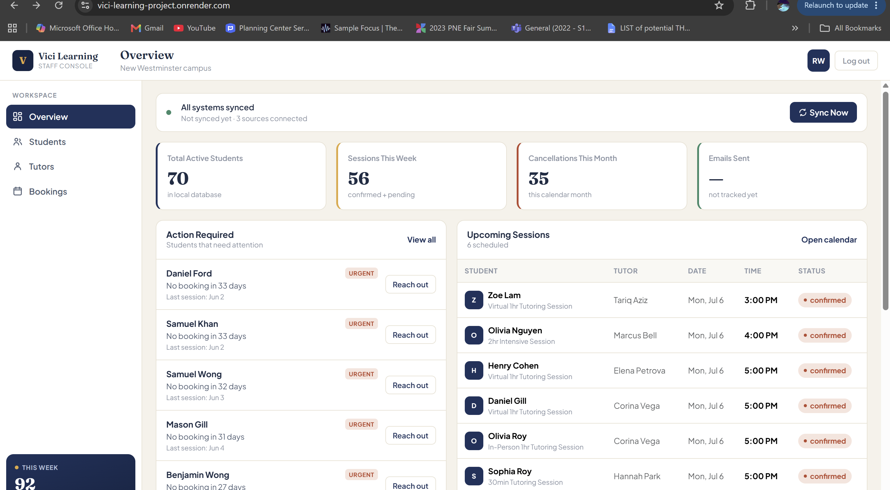
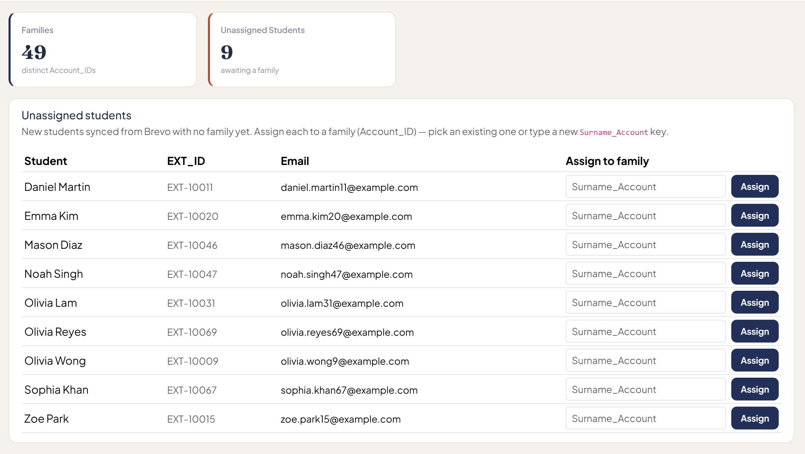
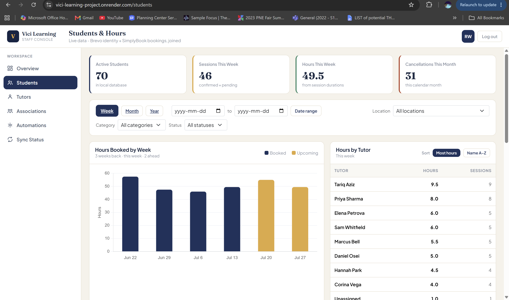
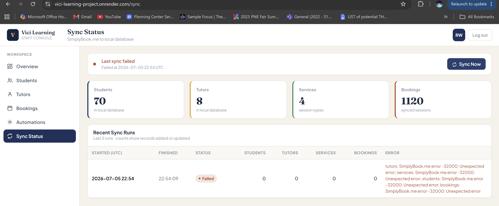

# Vici Learning Integration Dashboard
## Requirements and Specification Document

**Course:** CMPT 276, Group 15
**Client:** Sarah Alhower, Vici Learning
**Date:** 08/02/2026
**Version:** 3.0 (Iteration 3)

### Change marking key

Everything added or changed for Iteration 3 is marked so you can see how the system grew since Iteration 2:

- **[NEW · Iteration 3]** marks a story or section that did not exist in Iteration 2 (shown in green).
- **[UPDATED · Iteration 3]** marks content that existed in Iteration 2 and changed this iteration (shown in blue).

Content with no marker is carried over from earlier iterations unchanged.

---

## Submission Info

| Item | Link / Value |
|------|--------------|
| Git repository | https://github.com/WL0000000/Vici-Learning-Project |
| Live web app (Render) | https://vici-learning-project.onrender.com |
| Admin login | username `Admin`, password `ViciLearning2026` |
| Screencast | see the link submitted alongside this document |

Tutor accounts are created through the registration page. A new signup that is not a senior tutor is held as pending until an admin approves it, so a marker who wants to see the tutor portal should either sign up and then approve the account from the admin users page, or ask us for a pre-approved tutor login.

---

## Project Abstract

Vici Learning is a tutoring company that runs its day to day work across several tools that do not talk to each other: SimplyBook.me for bookings, Brevo for email and client records, and Notion for the tutor list. Because the systems are separate, staff spend a few hours each week exporting reports and lining them up by hand in a spreadsheet to answer basic questions, such as which students have stopped booking or which families still owe for sessions. Our web application sits on top of those tools, pulls their data into one PostgreSQL database on a schedule, and gives staff a single place to check bookings, group students into families, watch prepaid session balances, and act on the follow up work that used to live in the spreadsheet. The dashboard reads only from the local database, so pages stay fast and keep working even when an outside service is briefly down.

**[UPDATED · Iteration 3]** Iteration 3 took the application from something that ran on our own sandbox data to something deployed against the client's real accounts. We set up the production database, deployed the app, and ran the first sync against Vici's live SimplyBook and Brevo data on site. That visit changed our understanding of how the client's data is really shaped, and a good part of this iteration was spent correcting the application to match it.

## Customer

The customer is the administrative and operations staff of Vici Learning, led by the owner, Sarah Alhower. These are the people who currently keep the business running by reconciling exports from several separate systems every week. **[UPDATED · Iteration 3]** Tutors are now a real user type rather than a future one: each tutor gets a login and a portal limited to their own students and bookings. Parents and students are never users of this application. It is an internal staff tool, and the client has been firm that client data must stay inside the staff-only side.

## Competitive Analysis

There are established tutoring management products in this market, including TutorCruncher, Teachworks, and Oases. They are capable, but they solve Vici's problem by replacing the tools Vici already pays for and knows how to use. Moving to one of them would mean dropping the SimplyBook.me and Brevo subscriptions, migrating years of data, retraining staff, and taking on per-seat or per-student fees. The client set a hard rule that the project runs on free tiers and existing subscriptions only.

Our approach is different in that we do not replace anything. The dashboard reads from Vici's current tools and joins their data in one view, so staff keep booking in SimplyBook.me and emailing in Brevo exactly as they do now. The piece we own that no off-the-shelf product gives Vici is the family-to-student mapping, the "association account". **[UPDATED · Iteration 3]** The onsite visit made this differentiator even clearer. We confirmed that Vici's family grouping does not live in any single field the other tools expose: SimplyBook has no parent-to-child relationship, and Brevo only groups families through segments, which do not come out cleanly over the API. Our dashboard is the one place that holds an authoritative, staff-owned map from each real student to their family, which is exactly the manual join the staff maintain by hand today.

---

## User Stories

### Actors

- **Administrator (persona: Jane).** Jane runs the front office at Vici. She books sessions, chases families who have not paid, assigns new students to their family accounts, and needs the full picture across every student. She maps to the `ADMIN` role.
- **Staff (persona: Priya).** **[NEW · Iteration 3]** Priya is an operations staff member who does the same day to day work as an admin but does not manage user accounts. She maps to the `STAFF` role, added this iteration.
- **Tutor (persona: Joe).** Joe teaches a handful of students each week. He wants to see who he is working with and how many hours are on the books. He has no reason to see a family's billing account or the sync and email tools. He maps to the `TUTOR` role.
- **The system (scheduled sync).** Some stories are carried out by a background job rather than a person. The hourly sync runs on its own and records what it did in a log an administrator can read.

Each story lists its actors, the trigger and preconditions, the actions and the resulting state, and acceptance tests with concrete values for both a success case and a failure case. Every story also carries an `Iteration` field and a story-point estimate. Story points use a Fibonacci scale (1, 2, 3, 5, 8, 13), where higher numbers mean more effort and more uncertainty.

### Carried-over stories

Stories 1 through 17 from Iterations 1 and 2 still hold and are documented in the Iteration 2 report. They cover the account system and role split (Stories 1 to 6), the dashboard metrics and the SimplyBook sync (Stories 7 and 8), the association account database (Stories 9 to 12), and the student and family dashboard with actionable tasks (Stories 13 to 17). **[UPDATED · Iteration 3]** One of them changed in a way worth calling out here: Story 16, the enrolment status, was reworked this iteration once we saw the real data, and Story 9, the unassigned-student queue, now runs on the Brevo roster described below. Both changes are covered in the new stories rather than repeated.

---

### Iteration 3 stories [NEW]

Iteration 3 had two threads. The first was making the product deployable to the client and correcting it against the real data we saw on site, which produced Stories 18 through 24. The second was the two role-scoped features that were planned as future work last iteration, the tutor portal and the Notion tutor management, which produced Stories 25 through 27.

#### Story 18: Deploy the system with versioned database migrations [NEW · Iteration 3]
As the team deploying for the client, I want the database schema to be created and updated by versioned migration files so that a deploy to the client's database is repeatable and does not need a hand-run change every time a column is added.

- **Actors:** the system, administrator.
- **Preconditions / trigger:** the application starts against a PostgreSQL database, either an empty one or one that already holds data.
- **Actions / postconditions:** Flyway runs the migration files in order before the application serves any request. On an empty database it builds the whole schema. On a database that already has the tables, it records a baseline and applies only the newer migrations. Hibernate is set to validate the schema rather than change it, so the running application never alters the database on its own.
- **Acceptance tests:**
  - Success: starting against a fresh database applies migrations V1 through V4 in order, the application boots, and the schema-validation check passes. Starting again against that same database applies nothing new and boots cleanly.
  - Failure: starting against a database that was built by the old auto-update path, and so has the tables but no migration history, records a baseline and then applies the newer migrations without a manual change, and the running app still validates against the entities.
- **Iteration:** 3
- **Story points:** 8

#### Story 19: Build the student roster from Brevo [NEW · Iteration 3]
As an administrator, I want the student list to come from Brevo, keyed by each student's external id, so that it shows the real students rather than the duplicated and out-of-date client list in SimplyBook.

- **Actors:** the system, administrator.
- **Preconditions / trigger:** the sync runs against Brevo, where each real student is a contact whose `CONTACT_TYPE` is "Student" and which carries a unique `EXT_ID`.
- **Actions / postconditions:** the sync reads every Brevo contact, keeps the ones marked as students, and stores each one in the roster keyed by its `EXT_ID`, along with its name, email and phone where present, and its enrolment status. Contacts that are not students, and contacts with no external id, are left out. The step preserves the family a staff member has assigned to a student across future syncs, and it never matches on email, since the client confirmed that some students have no email at all. This roster is what the students page, the overview student count, and the association page now read from. The SimplyBook client records are kept as a separate account layer that bookings, invoices, and memberships still attach to.
- **Acceptance tests:**
  - Success: a Brevo response with one contact of type "Student" carrying `EXT_ID` "EXT-1", one contact of type "Tutor", and one student contact with no external id, produces exactly one roster student, keyed by "EXT-1", with the name and status read from the student contact. The other two are skipped.
  - Failure: if Brevo returns nothing, because the key is missing or switched off, the step logs that it was skipped, changes no roster records, and the rest of the sync still runs.
- **Iteration:** 3
- **Story points:** 13

#### Story 20: Show and set the four enrolment statuses [NEW · Iteration 3]
As an administrator, I want each student shown with their real enrolment status and a way to change it, so that I can tell who is currently enrolled and correct a status when needed.

- **Actors:** administrator, staff, the system.
- **Preconditions / trigger:** the roster is synced. The admin opens the students page, and can pick a status from the roster filter or click the control on a student's row.
- **Actions / postconditions:** each student row shows one of the four statuses the client actually uses, Active, Paused, Dropped, or Completed, read from Brevo's `CONTACT_STATUS`. The overview counts a student as current when they are Active or Paused. An admin or staff member can set a student's status from the row, which updates the roster record right away.
- **Acceptance tests:**
  - Success: a student whose Brevo status reads "Paused" shows a Paused badge after a sync. Choosing the Paused filter shows that student and hides the active ones. Clicking the control to set them Active updates the badge on the next load.
  - Failure: a status value the app does not recognise leaves the student's current status unchanged rather than blanking it, and posting a status change for an unknown student id changes nothing and does not error.
- **Iteration:** 3
- **Story points:** 5

#### Story 21: Group the real Brevo students into families [NEW · Iteration 3]
As an administrator, I want to assign each real student to a family, so that siblings are grouped together in the one place the business keeps that mapping.

- **Actors:** administrator, staff.
- **Preconditions / trigger:** the roster is synced. A student has no family assigned yet, so it sits in the unassigned queue on the associations page.
- **Actions / postconditions:** the association page lists the unassigned roster students and lets a staff member place each one into a family by picking or typing a family key. The assigned student moves into that family in the rollup, and the assignment sticks across future syncs. Because Brevo has no usable family field, this map lives entirely in our database and is owned by staff, which is the point of the feature.
- **Acceptance tests:**
  - Success: assigning an unassigned roster student "Ashe Collett" to the family key `Collett_Account` removes them from the unassigned queue and lists them under the `Collett_Account` family, and the assignment survives the next sync.
  - Failure: submitting the assign form with the family field empty is rejected, and the student stays in the unassigned queue.
- **Iteration:** 3
- **Story points:** 3

#### Story 22: Show each family's session balance, expiry, and next invoice [NEW · Iteration 3]
As an administrator, I want each family shown with its remaining prepaid sessions, when the membership expires, and the linked invoice number, so that I can see at a glance who needs to renew and which invoice it ties to.

- **Actors:** administrator.
- **Preconditions / trigger:** memberships are synced. The admin opens the students page and expands a family.
- **Actions / postconditions:** each family shows the remaining sessions from its latest membership, an "unlimited" marker for packages that do not count down, the expiry date, and the invoice number. The remaining count reads the true remaining field from the client's data rather than the package total, and an unlimited package is shown as unlimited rather than as a balance of zero.
- **Acceptance tests:**
  - Success: a family whose latest membership has 5 sessions left, expires on 01 Aug 2026, and links to invoice `SI-2026000096`, shows "5 left, expires Aug 1 2026, invoice SI-2026000096".
  - Failure: a family whose latest membership is an unlimited package shows an unlimited marker and no session countdown, and is not flagged as a low or empty balance.
- **Iteration:** 3
- **Story points:** 5

#### Story 23: Show invoices as paid or unpaid reliably [NEW · Iteration 3]
As an administrator, I want the cash-flow view to decide paid or unpaid from the client's real payment flag rather than by guessing from a status word, so that the amounts owed are correct.

- **Actors:** administrator.
- **Preconditions / trigger:** invoices are synced. The admin opens the overview.
- **Actions / postconditions:** each invoice's paid state is taken from the explicit payment-received flag the client's system returns. When that flag is present it decides the outcome. When it is absent, the app falls back to reading the status word, so older records still work.
- **Acceptance tests:**
  - Success: an invoice whose status word reads "pending" but whose payment-received flag is set is treated as paid and stays out of the unpaid list.
  - Failure: an invoice with the payment-received flag explicitly not set is treated as unpaid even if a status word says otherwise, so it is not hidden from the amount owed.
- **Iteration:** 3
- **Story points:** 3

#### Story 24: Count cancellations correctly for this client [NEW · Iteration 3]
As an administrator, I want a cancelled booking counted as a cancellation and kept out of the workload total, so that hours and cancellation figures match how the client's account works.

- **Actors:** administrator, the system.
- **Preconditions / trigger:** bookings are synced. The client confirmed on site that they use no booking-approval step and that cancelled bookings stay in the system, so an unconfirmed booking is a cancellation rather than a pending one.
- **Actions / postconditions:** the sync marks an unconfirmed booking as cancelled. A cancelled booking is left out of the weekly hours and session counts and is counted in the monthly cancellations figure.
- **Acceptance tests:**
  - Success: a booking that comes in unconfirmed is stored as cancelled, does not add to the week's hours, and adds one to the month's cancellations.
  - Failure (guard the other way): a confirmed booking is stored as confirmed and does count toward the week's hours, which confirms the rule only affects unconfirmed bookings.
- **Iteration:** 3
- **Story points:** 2

#### Story 25: Give each tutor a portal limited to their own students [NEW · Iteration 3]
As a tutor (Joe), I want a portal that shows only my own students and my own bookings, so that I can see who I am working with without seeing the whole school or any billing detail.

- **Actors:** tutor.
- **Preconditions / trigger:** a tutor is signed in and opens the tutor portal.
- **Actions / postconditions:** the tutor lands on their own overview and can open their students and bookings pages. The data is scoped to the signed-in tutor, so a tutor sees only the students they teach and the bookings they run. The portal is read only, since booking still happens in SimplyBook. A tutor may see a student's email or phone for emergencies, but never a family's billing account or the sync and email tools.
- **Acceptance tests:**
  - Success: a tutor who runs sessions for two students sees exactly those two students on their students page and their own upcoming bookings on the bookings page, and no family account or sync link appears anywhere.
  - Failure: a tutor who requests an admin route, such as the sync page or the users page, receives a forbidden response and is kept on their own portal.
- **Iteration:** 3
- **Story points:** 8

#### Story 26: Show consistency metrics and a look-ahead calendar to tutors [NEW · Iteration 3]
As a tutor, I want to see how consistently each of my students books and a calendar of the weeks ahead, so that I can spot a student who is slipping and plan my time.

- **Actors:** tutor.
- **Preconditions / trigger:** a tutor is signed in and opens their overview or bookings page.
- **Actions / postconditions:** the tutor's overview shows their number of students and the average sessions per student, and each student summary shows past session counts and sessions per week and month, so the figures reflect history rather than only what is upcoming. The bookings page shows the weeks ahead grouped by week, so the tutor can look forward and step through the coming weeks.
- **Acceptance tests:**
  - Success: a tutor with three students who between them had six past sessions sees an average of two sessions per student, and a student who booked twice this month shows a monthly count of two.
  - Failure: a tutor with no bookings yet sees zeros and an empty calendar with a "nothing scheduled" note rather than an error.
- **Iteration:** 3
- **Story points:** 5

#### Story 27: Manage the tutor list from Notion inside the dashboard [NEW · Iteration 3]
As an administrator, I want to read the tutor list from Notion and edit a tutor's details in the dashboard, and filter and sort that list, so that I keep the tutor database current without switching to Notion.

- **Actors:** administrator.
- **Preconditions / trigger:** the Notion integration is connected. The admin opens the tutors page.
- **Actions / postconditions:** the page reads the tutor records from Notion and shows them, and the admin can filter by active or inactive status and sort by fields such as subject and role. Editing a tutor's details and saving writes the change back to Notion through the API, so the dashboard and Notion stay in step.
- **Acceptance tests:**
  - Success: editing a tutor's phone number and saving sends the update to Notion and shows the new value on reload.
  - Failure: if the Notion connection is missing or read only, the save reports that it did not go through rather than silently dropping the change.
- **Iteration:** 3
- **Story points:** 3

---

### Future user stories

These are the pieces we did not build this iteration. The email work is the largest, and it moved because the onsite visit changed what the underlying data looks like.

- Send the four planned email types, session reminder, payment reminder, membership renewal, and lapsed follow-up, with a per-type choice of auto-send or review-first and an audit log of everything sent. This depends on the corrected roster from Story 19 and on the client's decision about giving the dashboard write access to Brevo.
- Add the payment-reminder schedule, about two weeks then 72 hours then 12 hours before an unpaid session, with an unsubscribe option on automated mail.
- Attribute hours to an individual student rather than a family, once there is a way to tell which student a booking was for. The client confirmed there is no such link today, so hours are shown per family for now.
- Write a staff status change back into Brevo, keyed by the student's external id, so the override survives the next sync. We held this because the status field is a list-type attribute whose write format we could not verify while the client's keys were switched off after the visit.

---

## User Interface Requirements

The login and registration pages, the role split, the sync page, the associations page, and the students page carry their mockups from the earlier iterations, and the full-size images are in the `docs/` folder.

**Overview dashboard** with the live metrics and the actionable-tasks inbox (Stories 7, 15, and 17):

**Associations page** (`/associations`), the unassigned-student queue and the editable family rollup. **[UPDATED · Iteration 3]** This page now runs on the Brevo roster from Story 19, so the students listed here are the real students keyed by external id:

**Students page** (`/students`) with the location, category, and status filters and the family rows. **[UPDATED · Iteration 3]** The roster now shows each real student with their external id and one of the four statuses, and each family shows its remaining balance, expiry, and invoice from Story 22:

**Sync status page** (`/sync`), which now also reports the roster step counts (Stories 8 and 19):

**[NEW · Iteration 3]** The tutor portal adds its own screens, an overview with the tutor's student count and average sessions per student, a students page limited to that tutor's students, and a bookings page with the weeks-ahead calendar (Stories 25 and 26). The Notion tutors page adds the filter and sort controls and the in-place edit form (Story 27).

---

## Iteration Progress and Velocity

We estimate each story in points on a Fibonacci scale before the iteration starts, then count the points actually delivered. A story counts only when it is merged to `main`, has tests, and works end to end. Velocity is the delivered total for the iteration, and we use it to size the next one rather than to grade ourselves.

### Points by iteration

| | Committed points | Delivered points | Velocity |
|---|---|---|---|
| Iteration 1 | 45 | 42 | 42 |
| Iteration 2 | 52 | 48 | 48 |
| Iteration 3 | 58 | 55 | 55 |

### Iteration 3 breakdown

| Story | Points | Delivered |
|---|---|---|
| 18. Deploy with versioned migrations | 8 | Yes |
| 19. Build the student roster from Brevo | 13 | Yes |
| 20. Show and set the four statuses | 5 | Yes |
| 21. Group the real students into families | 3 | Yes |
| 22. Family balance, expiry, and invoice | 5 | Yes |
| 23. Show invoices paid or unpaid reliably | 3 | Yes |
| 24. Count cancellations correctly | 2 | Yes |
| 25. Tutor portal limited to own students | 8 | Yes |
| 26. Tutor consistency metrics and calendar | 5 | Yes |
| 27. Manage the tutor list from Notion | 3 | Yes |
| **Delivered total** | **55** | |

We committed 58 points and delivered 55. The 3 points held were the write-back of a staff status change into Brevo. We deferred it because the status field on the client's account is a list-type attribute, and we could not verify how to write it safely once the client's API keys were switched off after the onsite visit. Writing the wrong shape into the client's live contacts was a worse outcome than leaving the status change as a local override for now, so we held it.

### What the velocity tells us

Velocity rose again, from 48 to 55, but the more useful thing this iteration is what the number does not show. The plan going into Iteration 3 was the tutor portal, the Notion management, the status control, and the start of the email queue. When we deployed to the client's real database and ran the first sync on site, we found the student roster was built from the wrong source and matched on a key that does not hold for this client. That sent us back to rebuild the roster from Brevo (Story 19) and to correct the membership, invoice, and cancellation handling against the real data (Stories 22 to 24). We swapped the planned email work for that rebuild mid-iteration. The delivered total came out close to plan because the rebuild was about the size of the email epic it replaced, but the work was different from what we set out to do. For a hypothetical fourth iteration we would commit to about 50 points, in line with our three-iteration average of 48, and spend it on the email queue now that the data it depends on is correct.

---

## Testing Notes

Every story above is backed by automated tests as well as manual checks, and the suite currently holds 145 passing tests. On the deployment side, we verified the migration chain against a real PostgreSQL database rather than only the in-memory test database: a fresh database applies all four migrations and passes schema validation, and a database that already has the tables records a baseline and then applies the newer migrations without a hand-run change. On the roster side, we test that the Brevo pull keeps only student-type contacts, keys them by external id, skips a contact with no external id, and returns nothing rather than wiping the roster when the API fails. The status, association, and family work has unit tests for the four-status parsing and filter, the status control by external id, the family grouping that joins the roster to the SimplyBook accounts, and the family membership summary including the unlimited case. The financial fixes are tested with the real data shapes we saw on site, so the invoice paid flag and the nested membership fields are checked against the exact field names the client's account returns, and the cancellation rule is checked both ways. Alongside the automated suite we ran the application end to end against seeded data at the client's real volume, signing in and walking through the overview, the students roster, the associations page, and the tutor portal, and we ran the live sync on site against the client's own accounts.

## Retrospective

The branch-and-review workflow held up for a third iteration, with every change going in through a pull request a teammate reviewed, and this iteration produced more pull requests than either earlier one. The big lesson was about the value of testing against the real thing early. Our sandbox data had quietly taught us a data model that turned out not to match the client's, and it was only the onsite sync that showed the student roster, the enrolment status field, and the family link were all different from what we had built. Catching that on site, rather than after handing the product over, is the reason we could correct it in the same iteration. The rough edge was that we could not finish verifying every corrected field or the status write-back, because the client's API keys were switched off when we left, so a few items are built behind configuration and wait on the next time we can run a live sync. For the future we want to close the email queue, which is the client's largest remaining request, and to settle with the client how a booking can be tied to an individual student so that hours can be shown per student rather than per family.
